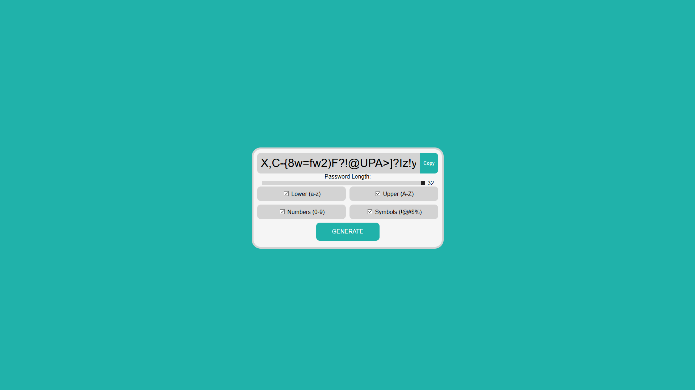

# 🔐 Password Generator – Générateur de mots de passe sécurisés

Ce projet est un **générateur de mots de passe** en ligne, conçu pour créer rapidement des mots de passe forts et sécurisés. Il permet aux utilisateurs de définir la longueur, le type de caractères (lettres, chiffres, symboles) et de copier facilement le mot de passe généré.

## 🌐 Démo en ligne

🔗 [Accéder au Password Generator](https://lucas-godebout.mds-angers.yt/password-generator/)

## 📸 Aperçu

## 🎯 Objectifs du projet

- Fournir un outil simple pour générer des mots de passe sécurisés
- Permettre à l’utilisateur de personnaliser la longueur et le type de caractères
- Appliquer des compétences en HTML, CSS et JavaScript pour créer une interface interactive

## 🛠️ Technologies utilisées

- **HTML5** – Structure du site
- **CSS3** – Mise en forme et design responsive
- **JavaScript** – Logique de génération aléatoire des mots de passe

## 🧩 Fonctionnalités principales

- 🔢 Choix de la **longueur** du mot de passe
- 🔡 Sélection des types de caractères : lettres, majuscules, chiffres, symboles
- 🎯 Génération instantanée d’un mot de passe aléatoire
- 📋 Bouton pour **copier facilement** le mot de passe

## 👤 Réalisé par

- **Lucas Godebout** – Développement front-end et design

## 📆 Contexte

Ce projet a été réalisé dans le cadre d’un module de développement web personnel afin de créer des mots de passes privé et différents.

## 📄 Licence

Projet éducatif – Tous droits réservés © 2025
